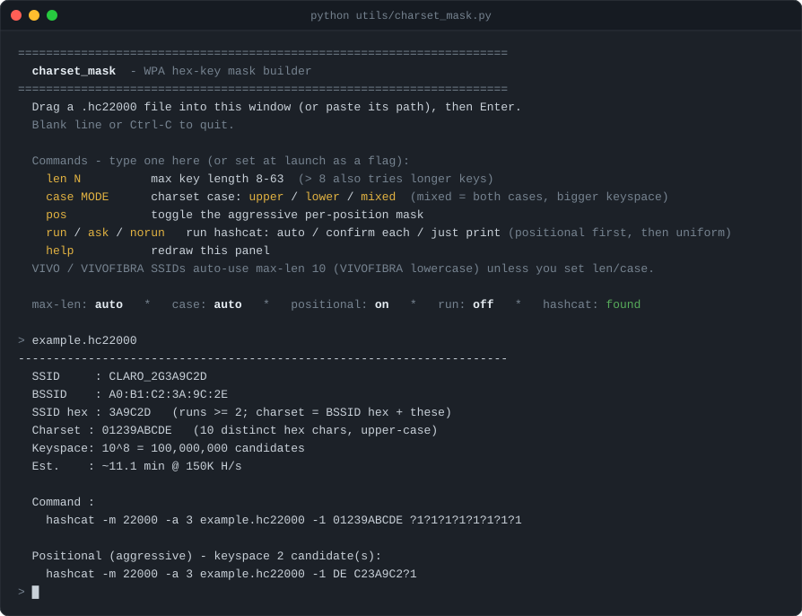

# charset_mask — WPA hex-key mask builder

A standalone helper (stdlib only) that reads a `.hc22000` capture and, for each
network, prints a ready-to-run **hashcat mask attack** whose custom charset is only the
hex characters that actually appear in that network's BSSID and SSID. When a WPA key is
derived from the device MAC — as many ISP-default keys are — those hex digits surface
in the BSSID and in the SSID, so restricting the mask alphabet to just them keeps the
key inside the keyspace while making that keyspace far smaller than the full `0-9A-F`.



> For authorized auditing of your own / consented equipment only. See
> [SECURITY.md](../SECURITY.md).

## Requirements

- Python 3.6+ (standard library only — nothing to install)
- hashcat on your `PATH` to actually run the emitted command (optional — the tool
  prints the command either way)

## Quick start

```
# Interactive menu (drag-and-drop friendly): run it with no arguments
python utils/charset_mask.py

# Or analyze a capture directly
python utils/charset_mask.py capture.hc22000
```

## The interactive menu

Run with no arguments and you get a panel you can drive without relaunching. Drag a
`.hc22000` file into the window (or paste its path) to analyze it; type a command to
change a setting, which clears and redraws the panel with a `>> redrawn` cue; a blank
line or Ctrl-C quits.

| Command | Effect |
|---------|--------|
| `len N` | set the maximum key length (8–63) |
| `case upper` / `lower` / `mixed` (or the bare word) | set the charset case |
| `pos` | toggle the aggressive per-position mask |
| `run` / `ask` / `norun` | run hashcat automatically / confirm each run / just print (default) |
| `help` | redraw the panel |
| *(a file path)* | analyze that capture with the current settings |

The status line shows the live state: `max-len · case · positional · run · hashcat`.

## Command-line flags

Every setting can also be set at launch. Flags and file paths can be combined; dragging
a file onto the `.py` icon passes it as a path.

| Flag | Default | Meaning |
|------|---------|---------|
| `--max-len N`, `-L N` | `8` | longest key length to try (8–63). `> 8` emits a hashcat `--increment` run that also tries the shorter lengths. The minimum stays fixed at 8 (the WPA-PSK minimum). |
| `--case upper\|lower\|mixed` | `upper` | letter-case of the hex charset. |
| `--positional`, `-p` | off | also print the aggressive per-position mask. |
| `-y`, `--run` | off | run hashcat instead of just printing (see **Running hashcat**). |
| `--ask` | off | run hashcat, but confirm each run first. |
| `-n`, `--no-run` | on | print-only (the default). |
| `--no-color` | color on (TTY) | disable ANSI color (the `NO_COLOR` env var is honored too). |

```
python utils/charset_mask.py --max-len 10 --case mixed --positional capture.hc22000
python utils/charset_mask.py -y --positional capture.hc22000   # run it: positional, then uniform
```

## How the charset is built

For each network the alphabet is the distinct hex characters (`0-9 A-F`) found in:

1. the **BSSID** (all 12 hex digits), and
2. the **SSID's hex runs** — any span of 2+ adjacent hex characters anywhere in the
   name. Isolated hex-valid letters (e.g. the single `A` in `CLARO`) are skipped so
   they don't bloat the alphabet.

Including a run only ever *widens* the alphabet, so it can never drop a character the
key needs — it's a safe superset of the SSID tail.

## Case modes

WPA keys are case-sensitive ASCII, and default keys are printed in different cases by
different vendors — so pick the case that matches the label, or hedge with `mixed`.

- **`upper`** (default) — `A-F` uppercase, e.g. `01239ABCDE`
- **`lower`** — `a-f` lowercase, e.g. `01239abcde`
- **`mixed`** — *both* cases of every hex letter present (digits are caseless), e.g.
  `01239ABCDEabcde`. Use this when you don't know which case the key uses — but note it
  roughly **doubles the alphabet, and the keyspace with it** (keyspace is `n^length`).
  The tool prints the resulting keyspace and time estimate so you see the cost before
  committing to a run.

## Key length

The minimum is fixed at 8 (WPA-PSK's minimum). Raise the maximum with `--max-len` /
`len N` to also try longer keys; the tool then emits a hashcat `--increment` command
and prints a per-length keyspace/time table. Each extra character multiplies the
keyspace by the alphabet size, so watch the estimate.

## Known-scheme auto-defaults (VIVO / VIVOFIBRA)

When it runs inside this repo (so it can import [`schemes.py`](../schemes.py)),
`charset_mask` recognizes **VIVO-** and **VIVOFIBRA-** SSIDs and seeds their scheme's
defaults automatically — the default key is the router's MAC **minus its first octet** =
**10 hex characters**, uppercase for VIVO and lowercase for VIVOFIBRA:

| SSID | auto max-len | auto case |
|------|--------------|-----------|
| `VIVO-…` | 10 | upper |
| `VIVOFIBRA-…` | 10 | lower |

The report prints a `Scheme :` line when this fires. An **explicit `--max-len` or
`--case` always wins** over the auto-default. And because the alignment is exact (the key
*is* the last 10 MAC nibbles), the `--positional` mask targets length 10 and contains the
key with a tiny keyspace:

```
  SSID     : VIVOFIBRA-1234
  BSSID    : 34:57:60:00:AB:CD
  Scheme   : VIVOFIBRA -> max-len 10, lower  (auto; override with --max-len / --case)
  Charset : 01234567abcd   (12 distinct hex chars, lower-case)
  ...
  Positional (aggressive) - keyspace 16 candidate(s):
    hashcat -m 22000 -a 3 capture.hc22000 -1 1a -2 2b -3 3c -4 4d 576000?1?2?3?4
```

A **standalone copy** of `charset_mask.py` (no `schemes.py` alongside it) simply skips
this — the tool still runs, just without the vendor convenience.

## The aggressive `--positional` tier

Instead of one alphabet for every position, `--positional` builds a **per-position**
charset by aligning the BSSID's trailing hex and the SSID's hex tail to the key. Where
they agree (typically the high nibble of each MAC octet) the position becomes a fixed
literal; only where they diverge (the low byte) does it vary. Across ~1,400 real
MAC-derived gateways this collapses the keyspace from ~10⁸ to a **median of 4** (max 64)
while still containing the key.

The mask targets the **effective max length** — 8 by default, 10 for VIVO/VIVOFIBRA (see
below), or whatever `--max-len` sets — so it can also contain keys longer than 8, not
just 8-character ones.

It's a fast heuristic that *assumes* each key character comes from that position's
BSSID/SSID character — true for MAC-derived schemes, not guaranteed for an unknown one.
The uniform mask printed above it is always the exhaustive fallback.

**Mixed-case caveat:** hashcat's built-in hex classes are one-case only (`?H` upper,
`?h` lower). In `mixed` mode a position that would need a 5th custom charset can't be
written as a single mask, so the positional command isn't emitted — the tool says so
and points you at the uniform command instead.

## Reading the output

```
  Charset : 01239ABCDE   (10 distinct hex chars, upper-case)    <- the alphabet, its size, its case
  Keyspace: 10^8 = 100,000,000 candidates                       <- total candidates to try
  Est.    : ~11.1 min @ 150K H/s                                <- rough time at a baseline rate

  Command :
    hashcat -m 22000 -a 3 example.hc22000 -1 01239ABCDE ?1?1?1?1?1?1?1?1
```

`-m 22000` is hashcat's WPA/WPA2 mode and `-a 3` is a mask attack; `-1 <charset>` defines
the custom charset that each `?1` position draws from.

If hashcat is found on your `PATH` and it's a portable/extracted install (its `OpenCL/`
and `kernels/` folders sit next to the binary), the command is prefixed with a `cd` into
hashcat's own folder — in your shell's syntax (cmd / PowerShell / POSIX, auto-detected;
override with the `HASHCAT_SHELL` env var) — so it runs exactly as pasted from any
directory.

## Running hashcat

By default the tool only **prints** the command — copy and run it yourself. You can also
have it launch hashcat for you:

- `-y` / `--run` (menu: `run`) — run automatically, no prompts.
- `--ask` (menu: `ask`) — run, but confirm each launch first (the uniform prompt shows
  its time estimate).
- `-n` / `--no-run` (menu: `norun`) — print only. **This is the default.**

When it runs, hashcat is launched directly (as an argv list, from its own folder so it
finds `OpenCL/` and `kernels/`) — so what runs matches the printed command. **Ctrl-C
aborts the current run** and returns you to the prompt.

**With `--positional` there are two masks, so Run does a cascade:**

1. Run the **positional** mask first — it's tiny (keyspace 4–64) and finishes in seconds.
2. If hashcat reports it **cracked** the key (exit 0), stop.
3. If the positional mask **exhausts without a hit**, fall back to the **uniform** mask
   (the exhaustive, guaranteed-to-contain-the-key command). In `--ask` mode this fallback
   is confirmed first, since it can be a long run.

If the positional mask isn't representable (mixed-case overflow) or `--positional` is off,
Run just executes the uniform mask.

## See also

- [README.md](../README.md) — the CLARO / NET / VIVO default-key project this ships with
- [utils/charset_mask.py](../utils/charset_mask.py) — the script itself; its module
  docstring is the source of truth
